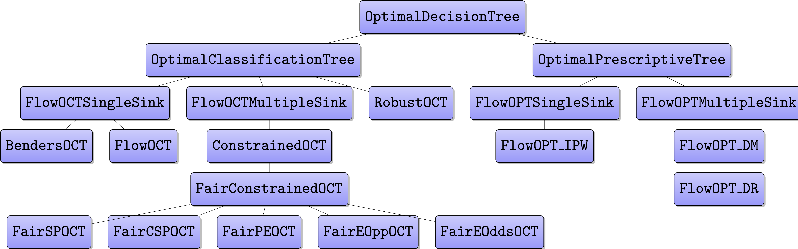

(api)=

# ODTlearn API

The software architecture of `ODTlearn` is motivated by the optimal decision tree literature
in which researchers have recently proposed numerous new problem classes, reformulation
strategies, and solution approaches. With this in mind, we have created a class structure for
our package that emphasizes structuring classes such that they are easy to
maintain and extend. The following Figure shows the inheritance diagram in `ODTlearn`. 



The classes in `ODTlearn` are derived from our abstract base class `OptimalDecisionTree`. This class provides a standardized interface for the two types of trees currently supported (classification
and prescription) while keeping their implementation details separate from one another.
`OptimalClassificationTree` and `OptimalPrescriptiveTree` extend `OptimalDecisionTree` by specifying problem-specific methods for traversing and visualizing the decision tree.
The structure prevents unnecessary code duplication within each child class. Next, the children of `OptimalClassificationTree` and `OptimalPrescriptiveTree` implement methods
for creating the decision variables, the constraints, and the objective function necessary
for constructing the optimization problem of interest. The separate classes for each of the
variations of the MIO formulations ensure that any changes to the structure of one problem formulation do not affect any of the other problem formulations. Finally, the leaf-node classes in the class diagram implement user-facing methods such as `fit` and `predict`. 

This class structure is meant to encourage other researchers and practitioners to build upon `ODTlearn` by augmenting it with more features (e.g., different
objectives or additional constraints) or even build new types of trees altogether. We provide an example of how to extend the `ODTlearn` API in our [user guide](./user_guide/index.md). The [example notebooks](./notebooks/index.md) and [user guide](./user_guide/index.md) for usage examples and additional information about the MIO formulations.


```{toctree}
:maxdepth: 4
autoapi/odtlearn/index
```